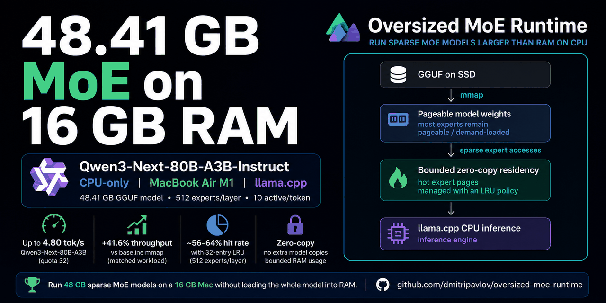

# Oversized MoE Runtime

Run sparse Mixture-of-Experts GGUF models that are larger than physical RAM
on CPU systems using mmap and bounded zero-copy expert residency on top of
llama.cpp.

## 48 GB model on a 16 GB Mac

**Qwen3-Next-80B-A3B-Instruct Q4_K_M — 48.41 GB GGUF — successfully running on a 16 GiB MacBook Air M1, CPU-only.**

    Model size:            48.41 GB
    Physical RAM:          16 GiB
    Oversubscription:      ~2.82x
    Backend:               CPU
    Metal:                 OFF
    Experts/layer:         512
    Active experts/token:  10
    Expert quota:          32 / tensor

Validated with both local completion inference and `llama-server`, including
an OpenAI-compatible `/v1/chat/completions` request.

The key mechanism is not loading another copy of the experts. The runtime keeps
the model mmap-backed and maintains a bounded zero-copy residency set for hot
expert pages.

See [BENCHMARKS.md](BENCHMARKS.md) for measurements and research results.

## Status

**Oversized MoE Runtime v0.1 released**

v0.1 has been validated end-to-end from the packaged source artifact with a
fresh build and 7/7 automated regression and smoke tests.

## Why

Sparse Mixture-of-Experts models can have very large total parameter counts
while activating only a small fraction of their experts for each token.

Oversized MoE Runtime explores how to take advantage of that property on
RAM-limited CPU systems.

The main target is:

    large total model capacity
    x
    small active MoE footprint
    x
    physical RAM oversubscription

## What it does

Oversized MoE Runtime adds a small policy and launcher layer on top of
llama.cpp.

For supported oversized sparse-MoE models it automatically:

- uses mmap-based model loading;
- avoids full mmap prefetch;
- disables repacking where required;
- calculates a RAM-aware expert residency budget;
- selects an expert residency quota;
- keeps frequently reused expert pages resident using a bounded zero-copy LRU;
- validates the resulting runtime policy before starting inference.

The runtime does not implement its own inference kernels or HTTP server.
llama.cpp remains the inference engine.

## Architecture

    +-----------------------------+
    |        GGUF on SSD          |
    +--------------+--------------+
                   |
                   | mmap
                   v
    +-----------------------------+
    |   Pageable model weights    |
    |                             |
    | most experts remain         |
    | pageable / demand-loaded    |
    +--------------+--------------+
                   |
                   | sparse expert accesses
                   v
    +-----------------------------+
    | Bounded zero-copy residency |
    |                             |
    | hot expert pages            |
    | managed with an LRU policy  |
    +--------------+--------------+
                   |
                   v
    +-----------------------------+
    |      llama.cpp CPU          |
    |        inference            |
    +-----------------------------+

The product layer decides the RAM budget and residency quota. llama.cpp remains
responsible for inference.

## CLI

Probe a model:

    oversized-moe probe MODEL.gguf

Run completion:

    oversized-moe run MODEL.gguf \
      -t 4 \
      -tb 4 \
      -c 512 \
      -n 64 \
      -p "Hello"

Run the server:

    oversized-moe serve MODEL.gguf \
      --host 127.0.0.1 \
      --port 8080 \
      -t 4 \
      -c 2048

## Supported architectures in v0.1

- Qwen3 MoE (`qwen3moe`)
- Qwen3-Next (`qwen3next`)

Unsupported or unknown sparse-MoE architectures are rejected rather than
handled using guessed memory policy.

## Validated platform

Primary validation platform:

    MacBook Air M1
    16 GiB unified RAM
    macOS arm64
    CPU-only
    Metal disabled

## Largest validated model

Qwen3-Next-80B-A3B-Instruct Q4_K_M:

    GGUF size:             48.41 GB
    physical RAM:          16 GiB
    oversubscription:      ~2.82x
    architecture:          qwen3next
    experts/layer:         512
    active experts/token:  10
    residency quota:       32 experts/tensor
    expert cache budget:   ~2.66 GiB

The model was validated with real CPU completion inference and llama-server,
including an OpenAI-compatible `/v1/chat/completions` request.

Qwen3-30B-A3B Q4_K_M was also validated with an automatic residency quota of
48 experts/tensor.

## Building

Configure the validated CPU-only macOS build:

    cmake -S . -B build \
      -DCMAKE_BUILD_TYPE=Release \
      -DGGML_METAL=OFF \
      -DLLAMA_BUILD_SERVER=ON \
      -DLLAMA_SUBPROCESS=ON \
      -DLLAMA_BUILD_TESTS=ON

Build:

    cmake --build build \
      --target \
        oversized-moe \
        oversized-moe-probe \
        oversized-moe-run \
        oversized-moe-serve \
        llama-completion \
        llama-server \
        oversized-moe-policy-tests \
        oversized-moe-cli-args-tests \
        oversized-moe-launch-plan-tests \
      -j4

Run the project test suite:

    ctest \
      --test-dir build \
      -R "^oversized-moe-" \
      --output-on-failure

The v0.1 release artifact passes:

    100% tests passed out of 7

More detailed runtime documentation is available in:

    tools/oversized-moe/README.md

## llama.cpp base

Oversized MoE Runtime v0.1 is based on llama.cpp commit:

    f280b26983ad0fdb705a0d9ebf0503e76f2899b0

The project currently carries a small productized engine patchset over
llama.cpp.

The original upstream README is preserved as:

    README.llama.cpp.md

## Release

The first source release is tagged:

    oversized-moe-v0.1

The release package contains:

- complete source archive;
- portable 16-patch product series;
- build instructions;
- release notes;
- SHA256 checksums.

## Current limitations

- v0.1 product support is limited to `qwen3moe` and `qwen3next`.
- Primary validation is currently macOS arm64 / Apple M1.
- Distribution is source-only.
- Memory-policy calibration is conservative rather than universally adaptive.
- A small patched llama.cpp engine surface is still required.
- Model files and model weights are not distributed with this project.

## Relationship to llama.cpp

Oversized MoE Runtime is an independent project derived from
[llama.cpp](https://github.com/ggml-org/llama.cpp).

It is not affiliated with, sponsored by, or endorsed by ggml-org or the
llama.cpp maintainers.

The original llama.cpp copyright and MIT License notices are preserved.
Third-party components retain their respective licenses.

See `NOTICE.md` for additional attribution and licensing information.

## License

This project is derived from llama.cpp and is distributed under the MIT
License.

The original llama.cpp copyright and license notices are preserved.
Modifications made for Oversized MoE Runtime are distributed under the same
MIT License.

See:

- `LICENSE`
- `NOTICE.md`
- `licenses/`

Model weights are not included in this repository and remain subject to their
own licenses and terms.

## Upstream

llama.cpp:

https://github.com/ggml-org/llama.cpp
